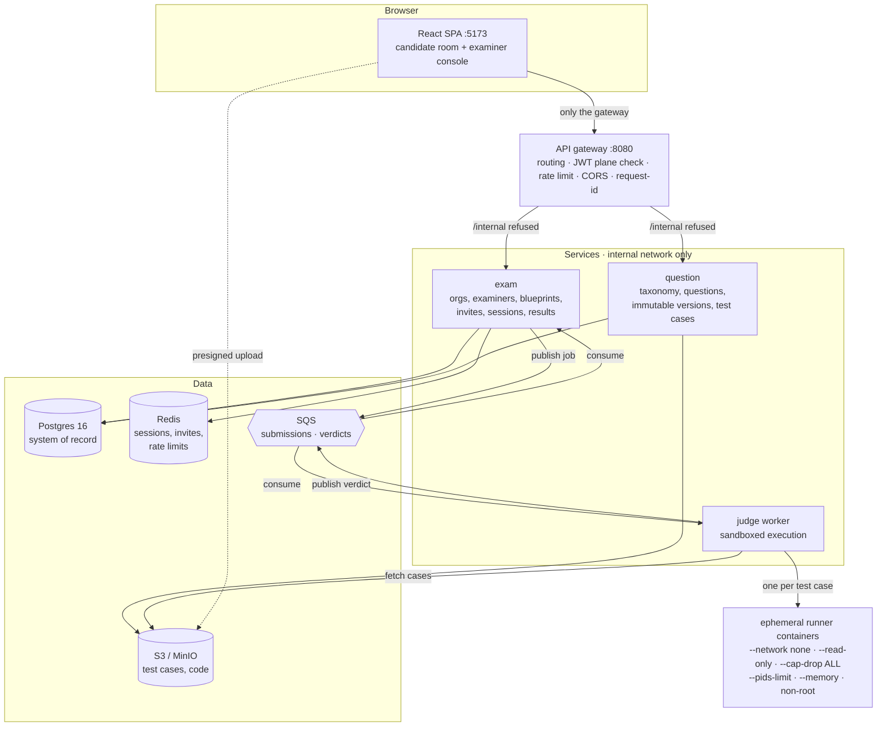

# DSA Exam Platform

An invite-only, adaptive DSA (data-structures & algorithms) assessment
platform. Examiners compose exams from a candidate's role and experience
profile; each candidate gets an equivalent-but-non-identical question set;
submissions are graded by a hardened, sandboxed judge.

> **Phase 1 (MVP) — complete.** Examiner auth + RBAC, question bank with
> immutable versions, seeded blueprint sampling, single-use Google-OIDC
> invites, a Docker-sandboxed judge (Python / Java / C++), the candidate exam
> room, the examiner console, and an edge gateway. See
> [`docs/PHASE1_PROMPT.md`](docs/PHASE1_PROMPT.md) for the slice-by-slice build
> and [`docs/architecture.md`](docs/architecture.md) for the full target
> system.

## Demo


<!-- TODO: record a 2–3 min walkthrough (examiner authors a question → invites a
candidate → candidate submits → verdicts appear) and drop it in at docs/demo.gif -->

## What makes it interesting

- **Blueprint engine** — an exam is a *versioned* weighted topic mix
  (`{topic, weight, difficulty range, count}`, weights sum to 100). It is
  concretized per candidate with deterministic seeding
  (`sha256(blueprint_version + candidate)`), so two candidates get equivalent
  but different question sets — anti-cheat by construction.
- **Immutable question versions** — editing a published question forks a new
  version; a submission always grades against the version the candidate saw.
- **A judge that must never fall over** — untrusted code runs in a per-test
  container with no network, read-only rootfs, a non-root uid, dropped
  capabilities, and CPU / memory / pids / wall-time / output caps. A standing
  escape-suite asserts fork bombs, rootfs writes, network egress, env/secret
  reads, and stdout floods all fail.
- **Two token planes** — examiners (password + TOTP) and candidates
  (single-use Google-OIDC invite → exam-scoped token) never mix; the gateway
  enforces the split at the edge and every service re-checks.

Phase 2+ (AI test-case factory with differential validation, WebSocket live
proctoring, mid-exam follow-ups) is designed for but not built — see
`docs/architecture.md`.

## Architecture



A single `X-Request-ID` is threaded from the gateway through both services and
across the SQS job into the judge and back, so one front-end call is one
correlated trace across structured JSON logs.

## Stack

- **Backend** — Python 3.12, FastAPI, Pydantic v2, SQLAlchemy 2.0 (async),
  Alembic; Postgres 16, Redis, SQS + S3 (localstack in dev); `uv` per service.
- **Judge** — Docker-out-of-Docker; per-language runner images
  (`python:3.12`, `eclipse-temurin:21`, `gcc:13`).
- **Frontend** — React 18 + TypeScript + Vite, TanStack Query, Monaco,
  react-markdown; Vitest + React Testing Library.
- **Edge** — a FastAPI gateway (httpx reverse proxy).

## Repo layout

```
services/gateway/   routing, JWT validation, rate limiting, request-id
services/exam/      auth+RBAC, blueprints, invites, sessions, results
services/question/  question bank, taxonomy, test cases (S3)
services/judge/     SQS consumer + sandboxed runners + escape suite
frontend/           candidate exam room + examiner console
infra/              docker-compose, localstack, Postgres init
scripts/e2e.py      full-MVP proof
docs/               architecture.md, PHASE1_PROMPT.md, DECISIONS.md
```

Hard rules the code holds to: services never import each other (HTTP or queue
only); every table is `org_id`-scoped; question versions are immutable; the
judge sandbox limits are never weakened to pass a test.

## Getting started

Prerequisites: Docker Desktop, [`uv`](https://docs.astral.sh/uv/), Node 20.

```bash
# 1. Build the sandbox runner images (once)
make judge-images

# 2. Bring up the whole stack (gateway :8080, frontend :5173, data services)
make dev

# 3. Start the judge worker.
#    On Linux it runs in compose; on macOS/Docker Desktop run it on the host
#    so its scratch dir is shared with the daemon:
cd services/judge && uv run python -m app.worker
```

Only the **gateway (:8080)** and the **frontend (:5173)** are published; the
exam and question services are reachable only on the compose network (which is
what keeps their unauthenticated `/internal` service-to-service endpoints off
the host).

## Prove it end to end

With `make dev` up and the judge worker running:

```bash
make e2e
```

`scripts/e2e.py` drives the whole MVP through the gateway: create an examiner
→ author a question with test cases → build a blueprint → invite a candidate →
authenticate → submit a correct **and** an incorrect solution → examiner reads
the verdicts. It asserts `AC` and `WA` respectively and that the examiner can
read the submitted code.

> The candidate's Google sign-in is the one step that cannot run headlessly
> (the backend verifies real Google ID tokens and there is deliberately no dev
> bypass). The script stands in for a completed sign-in by minting the same
> exam-scoped token the exchange endpoint issues; the OIDC rejection paths are
> covered by the exam service's automated tests.

## Tests & checks

```bash
make test            # all backend suites (exam, question, judge, gateway)
make test SVC=exam   # one service
make lint            # ruff + mypy (backend) and eslint + tsc (frontend)
cd frontend && npm test
```

The judge suite runs **real containers** (needs the runner images + Docker);
everything else is hermetic. Current totals: 154 backend + 32 frontend tests.

## Configuration

Dev defaults are baked in; nothing is required to run locally. Config is via
env vars (`.env` is gitignored). Notable ones: `JWT_SECRET` (shared token
signing), `GOOGLE_CLIENT_ID` (needed only to exercise the real sign-in leg —
see [`frontend/README.md`](frontend/README.md)), and the Postgres / Redis /
S3 / SQS endpoints. Secrets are never committed; schema changes go through
Alembic (`make migrate SVC=<svc> MSG="…"`).
